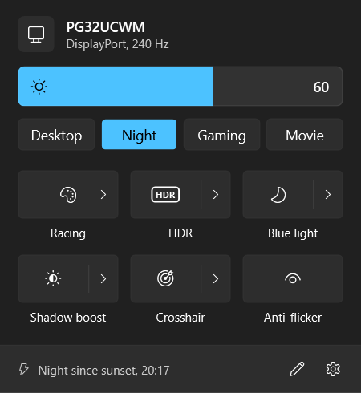
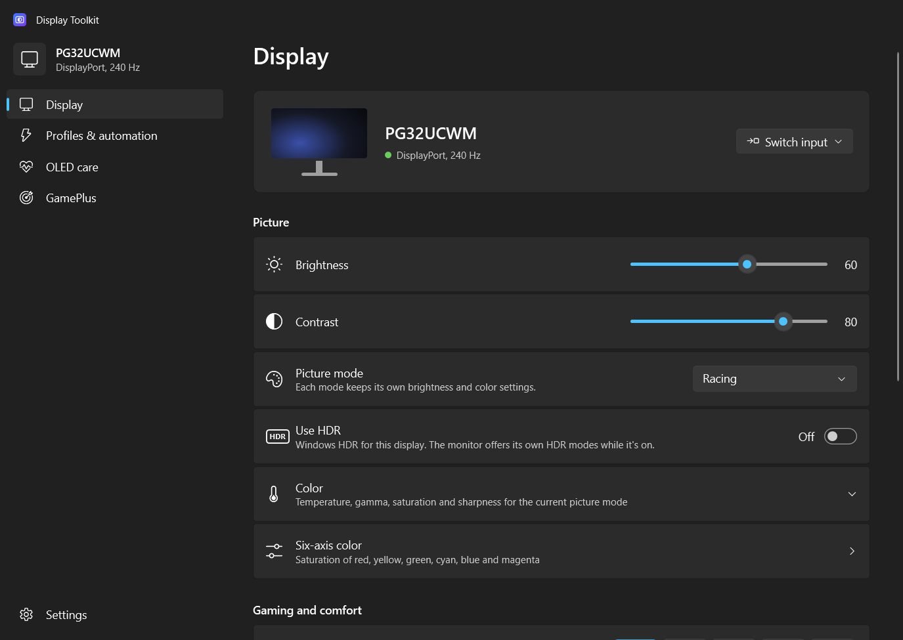
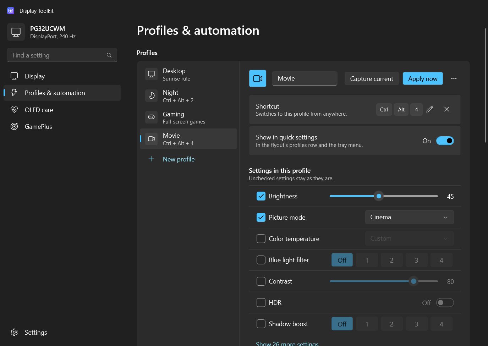
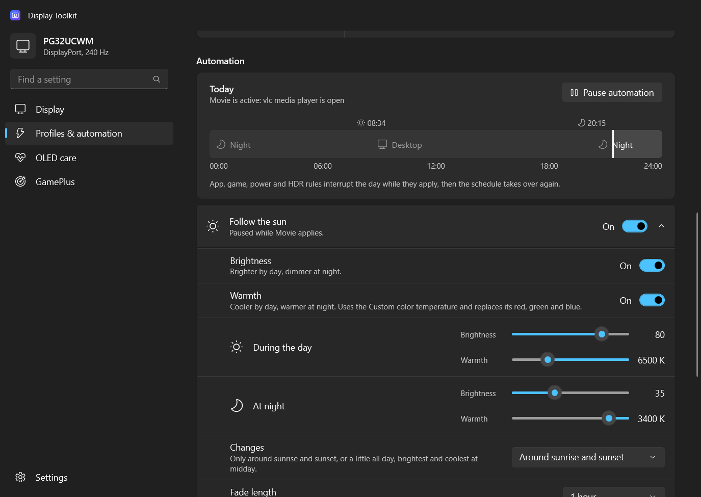
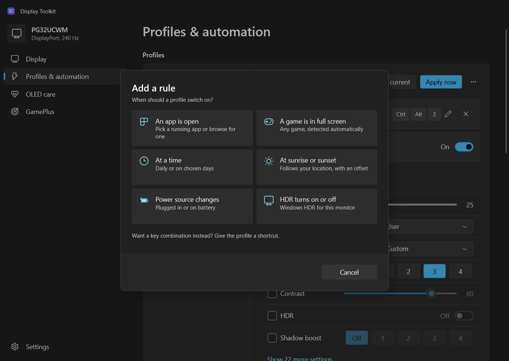

# Display Toolkit

A small, fast, open-source tray app for controlling ASUS monitors on Windows 11. Think
[Lenovo Legion Toolkit](https://github.com/BartoszCichecki/LenovoLegionToolkit), but for displays.

It replaces ASUS DisplayWidget Center with something calmer: brightness, picture modes, HDR presets, OLED care and
GamePlus overlays one click away in the tray, plus profiles that switch by game, app, time of day or sunset, and
brightness and warmth that follow the sun.

<p align="center">
  
</p>

> **Supported monitors:** built and tested on the ROG Swift PG32UCWM. Other ASUS gaming and OLED monitors that speak
> the same protocol should mostly work, because the app only shows what the monitor reports it supports.

## Features

- **Quick settings** from the tray icon or **Ctrl+Alt+D**: brightness, profiles and a tile grid you arrange yourself
  (picture mode, HDR, blue light filter, shadow boost, crosshair, OLED anti-flicker and more).
- **The full set of monitor settings** in the main window: picture and color (including six-axis saturation), OLED
  care (pixel cleaning, panel protection, proximity sensor), GamePlus, and the monitor's own system options.
- **Profiles**: a named set of settings, applied in the right order (HDR, then picture mode, then color, then the
  rest). Pick one in quick settings or the tray menu, or give it a shortcut; press the shortcut again to go back to
  automatic.
- **Rules** switch profiles for you: at a time, at sunrise or sunset, while an app or a full-screen game runs, on
  battery, or while HDR is on. A day strip shows what today will look like.
- **Follow the sun**: brightness and warmth fade between day and night values around sunrise and sunset.
- **Export and import** everything to move to a new PC.

## Screenshots

| | |
|---|---|
|  |  |
| **Display**: every setting the monitor offers, grouped the way Windows Settings does it. | **Profiles**: pick which settings a profile includes and give it a shortcut. |
|  |  |
| **Automation**: what the schedule does today, and brightness and warmth that follow the sun. | **Rules**: switch profiles at a time, at sunset, or while an app or game runs. |

## Install

Download from [Releases](../../releases):

- **`DisplayToolkit-<version>-win-x64.msi`**: the installer. It installs for your account only (no admin rights),
  adds Display Toolkit to the Start menu and to Installed apps, and updates an older version in place.
- **`DisplayToolkit-<version>-win-x64.zip`**: the portable version. Unzip it anywhere and run `DisplayToolkit.exe`.

Either way it's one self-contained app: no .NET or anything else to install. To start it with Windows, turn that on
in Settings.

Requirements:

- Windows 11
- A monitor with **DDC/CI enabled** in its on-screen menu, connected over DisplayPort or HDMI

Display Toolkit and ASUS DisplayWidget Center both talk to the monitor and can get in each other's way; close the
ASUS app while you use this one.

Settings, profiles and the log live in `%AppData%\DisplayToolkit`. Delete that folder to start fresh.

## How it works

Everything goes over **DDC/CI**, the standard monitor-control channel that Windows exposes through `dxva2.dll`.
No driver, no service, no ASUS software, no account and no telemetry. The only personal data it uses is your location
for sunrise and sunset, which comes from Windows (rounded to about a kilometer and kept on your PC) or is typed in.
See the [protocol notes](docs/research/asus-ddc-protocol.md) for the register map, verified on real hardware.

## Building

```
dotnet build
dotnet test
```

Requires the .NET 10 SDK. The solution is `DisplayToolkit.slnx`:

| Project | Purpose |
|---|---|
| `DisplayToolkit.Core` | Monitor discovery, capabilities, DDC/CI sessions. No UI. |
| `DisplayToolkit.Automation` | Profiles, rules, sunrise and sunset, and the engine that decides which profile applies. No UI. |
| `DisplayToolkit.App` | WPF tray app, flyout and main window. |
| `tools/DisplayToolkit.Probe` | Console tool that dumps what a monitor reports. Handy for bug reports and new models. |

`./build/publish.ps1` builds the release zip and the installer (WiX, restored from NuGet) into `artifacts/`. Pushing a tag like `v0.2.0` makes GitHub Actions
build, test and publish a release.

See [docs/architecture.md](docs/architecture.md) for the design and [docs/design](docs/design/design-spec.md) for the UI spec.

## License

[MIT](LICENSE). Display Toolkit is an independent project and is not affiliated with or endorsed by ASUS.
"ASUS", "ROG" and "GameVisual" are trademarks of ASUSTeK Computer Inc.
